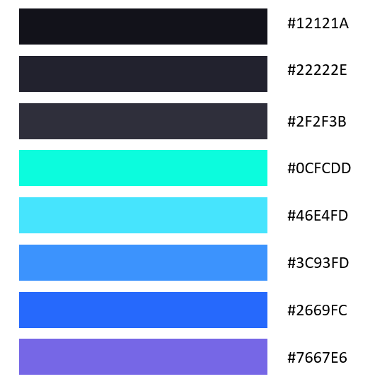

# Chat Database with Visualization Generation

A web application that allows users to chat with an AI agent to generate D3.js visualizations.

## Features

- Chat interface to interact with an AI agent
- D3.js visualization generation based on user prompts
- Git-like chat history visualization
- File explorer to browse and view generated visualizations

## Getting Started

### Prerequisites

- Python 3.8+
- Node.js 14+
- npm or yarn

### Backend Setup

1. Navigate to the backend directory:
   ```
   cd backend
   ```

2. Install dependencies:
   ```
   pip install -r requirements.txt
   ```

3. Run the server:
   ```
   uvicorn main:app --reload
   ```
   The backend will be available at http://localhost:8000

### Frontend Setup

1. Navigate to the frontend directory:
   ```
   cd frontend
   ```

2. Install dependencies:
   ```
   npm install
   ```
   or
   ```
   yarn
   ```

3. Run the development server:
   ```
   npm run dev
   ```
   or
   ```
   yarn dev
   ```
   The frontend will be available at http://localhost:5173

## Usage

1. Login with your wallet
2. Subscribe to get access to the AI features
3. Type a prompt in the chat box asking for a visualization (e.g., "Create a bar chart showing Bitcoin price trends")
4. The AI will process your prompt and generate a D3.js visualization
5. The file explorer will automatically open and highlight the newly generated visualization
6. Click on the highlighted file to view the visualization in the main area

### Example Prompts

- "Create a pie chart showing DeFi protocol distribution"
- "Generate a line chart of Ethereum transactions over time"
- "Show me a visualization of NFT sales by category"
- "Create a network diagram of token transfers between wallets"

## Project Structure

```
├── backend/
│   ├── database/       # Database handling and chat history logic
│   ├── data/           # JSON storage for chat history
│   ├── main.py         # FastAPI application
│   └── requirements.txt
├── frontend/
│   ├── src/
│   │   ├── components/ # React components
│   │   │   └── visualizations/ # Generated D3.js visualizations
│   │   ├── utils/      # Utility functions for API calls
│   │   └── App.jsx     # Main application component
│   ├── package.json
│   └── vite.config.js
└── ai-agent/           # AI agent implementation (placeholder for now)
```


## Colour Palette

#12121A
#22222E
#2F2F3B
#0CFCDD
#46E4FD
#3C93FD
#2669FC
#7667E6




## Precautions

reference [`frontend/src/components/visualizations/defi_transactions.js`](frontend/src/components/visualizations/defi_transactions.js)

1. Make sure the d3js visualization code has dynamic dimension

```
// Dynamic dimensions
const container = chartRef.current;
const width = container.clientWidth;
const height = container.clientHeight;

// Responsive SVG creation
const svg = d3.select(container)
  .append("svg")
  .attr("width", width)
  .attr("height", height)
  .attr("viewBox", [0, 0, width, height]);
```

2. Has proper classes for dynamic resizing

```
// Has proper container classes and resize handling
return React.createElement("div", { ref: chartRef, className: "w-full h-full bg-[#22222E]" });
```

3. Must useRef for the ResizeObserver to work

```
    const chartRef = React.useRef(null);
  
    React.useEffect(() => {
      ...
```

4. The function must be named GeneratedViz


#TODO: font for visualizations?
professional
# TODO: prompt to unlock wallet